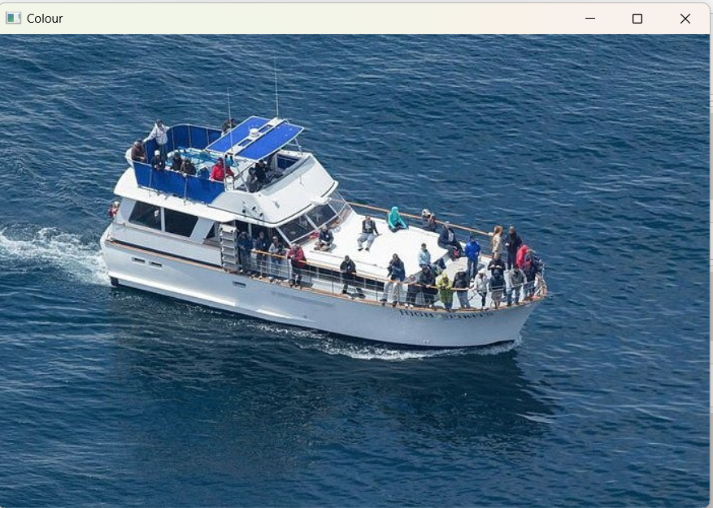
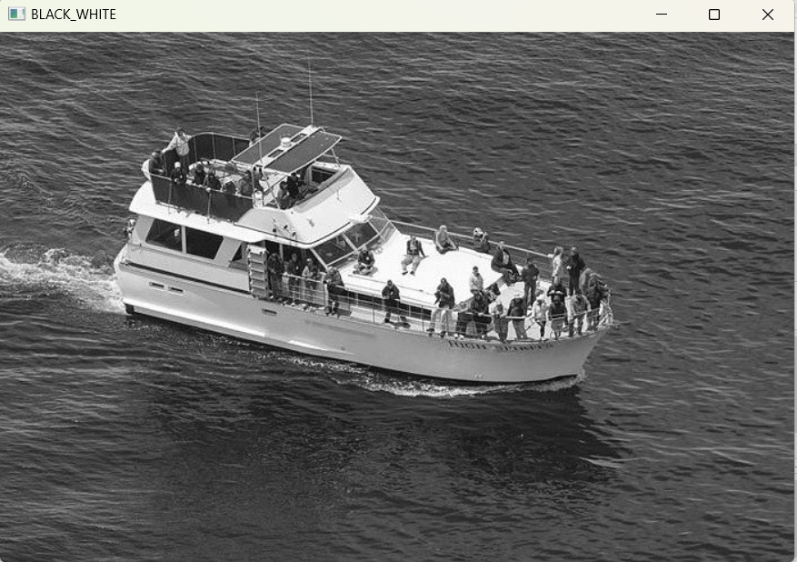
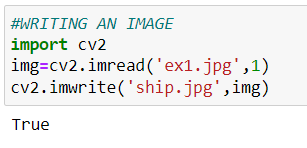
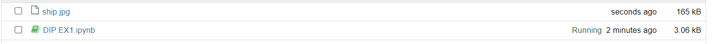
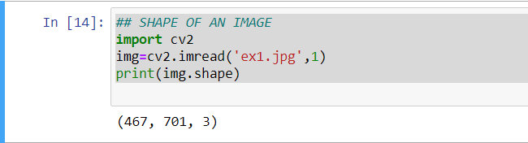
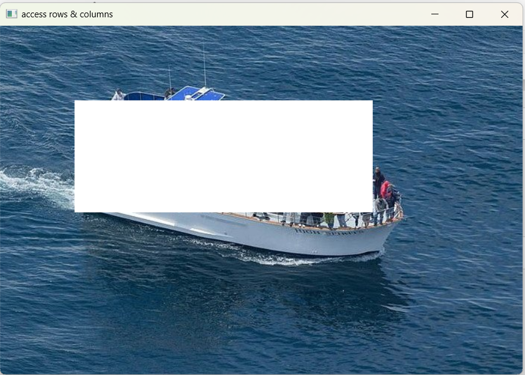
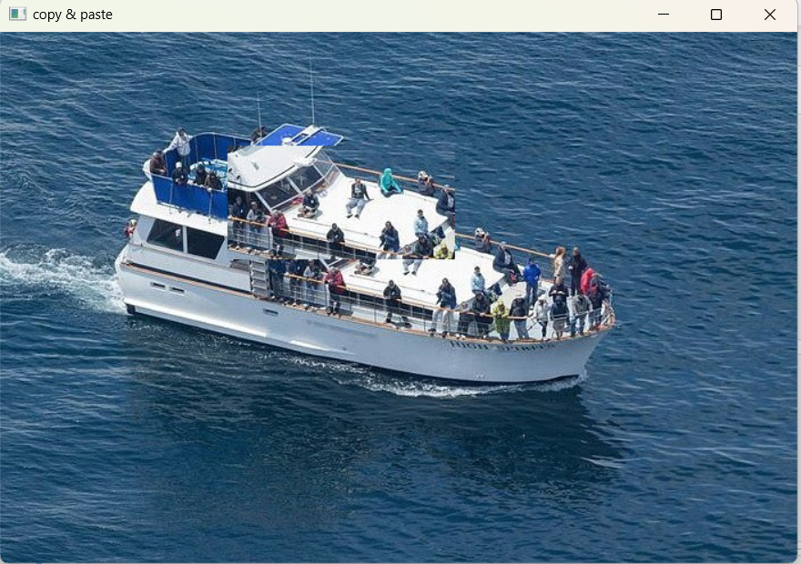

# READ AND WRITE AN IMAGE
## AIM
To write a python program using OpenCV to do the following image manipulations.
i) Read, display, and write an image.
ii) Access the rows and columns in an image.
iii) Cut and paste a small portion of the image.

## Software Required:
Anaconda - Python 3.7
## Algorithm:
### Step1:
Choose an image and save it as a filename.jpg
### Step2:
Use imread(filename, flags) to read the file.
### Step3:
Use imshow(window_name, image) to display the image.
### Step4:
Use imwrite(filename, image) to write the image.
### Step5:
End the program and close the output image windows.
## Program:
### Developed By: ANISH MJ
### Register Number: 212221230005
i) #To Read,display the image
```
import cv2
color = cv2.imread('ex1.jpg',1)
cv2.imshow("Colour",color)
cv2.waitKey(0)

import cv2
gray=cv2.imread('ex1.jpg',0)
cv2.imshow('BLACK_WHITE',gray)
cv2.waitKey()
```
ii) #To write the image
```
#WRITING AN IMAGE
import cv2
img=cv2.imread('ex1.jpg',1)
cv2.imwrite('ship.jpg',img)
```
iii) #Find the shape of the Image
```
## SHAPE OF AN IMAGE
import cv2
img=cv2.imread('ex1.jpg',1)
print(img.shape)

```
iv) #To access rows and columns

```
import cv2
img=cv2.imread('ex1.jpg',-1)
for i in range(100,250):
    for j in range(100,500):
        img[i][j]=[255,255,255] 
cv2.imshow('access rows & columns',img);
cv2.waitKey(0)
cv2.destroyAllWindows()
    
```
v) #To cut and paste portion of image
```

import cv2
img1=cv2.imread('ex1.jpg',-1)
cut=img1[150:250,250:450]
img1[100:200,200:400]=cut
cv2.imshow('copy & paste',img1)
cv2.waitKey(0)
cv2.destroyAllWindows()

```

## Output:

### i) Read and display the image





### ii)Write the image




### iii)Shape of the Image



### iv)Access rows and columns


### v)Cut and paste portion of image



## Result:
Thus the images are read, displayed, and written successfully using the python program.


